# ITP (INFORMATIC TEACHERS PLATFORM)

## Collaborator
- Muh. Ikram Abdillah Mata
- Yudi Arianto Latief
- Sri Febrina Ramadhani

> Build using CS, Python, Flask, HTML, JavaScript, Bootstrap, FontAwesome, and Sqlite for database

## About Application
The application serves as a digital forum for informatics teachers who are members of the MGMP community. This application provides information about the MGMP Informatics community, starting from activities and documentation of activities, meeting schedules and ultimately the community management structure. In this application, teachers can share lesson plans and good practices about informatics learning in the classroom.

## App Features
> Features:
  - Register and login feature for informatics teacher
  - Share and download lesson plans features
  - Share and download good practice features
> User:
  - Admin User for Admin
    + set the appearance of the app's main page 
      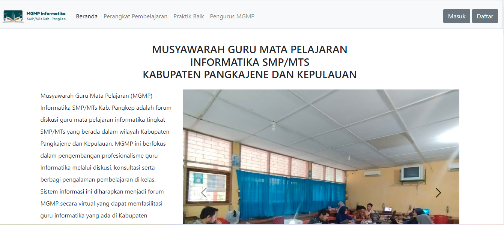

    + Set MGMP meeting schedules 
       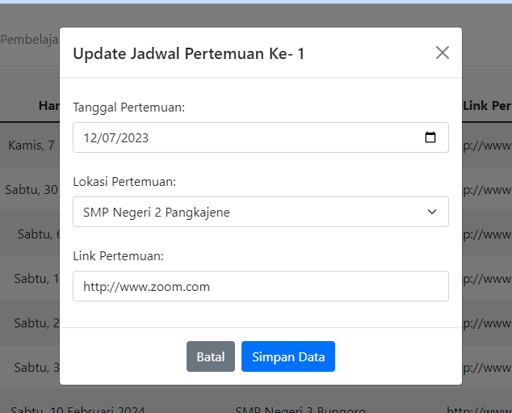

    + Confirming new user 
      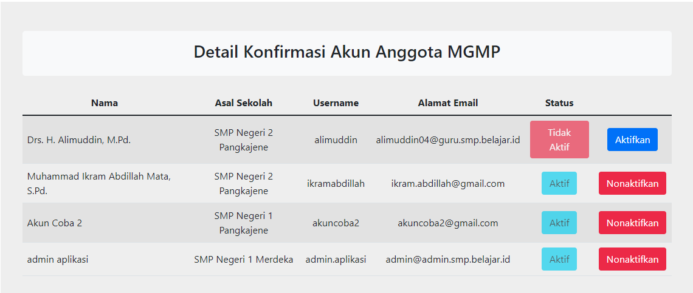

    + Manage mgmp community board member data 
      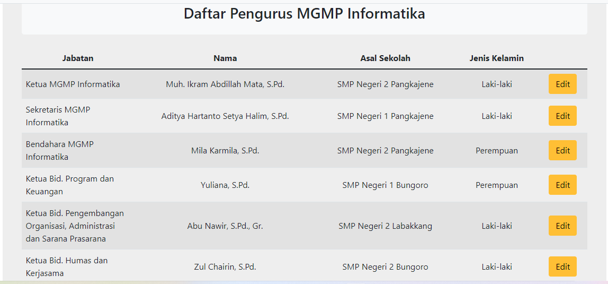 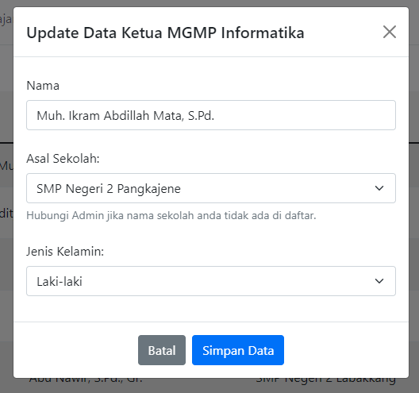

    + Manage school data 
      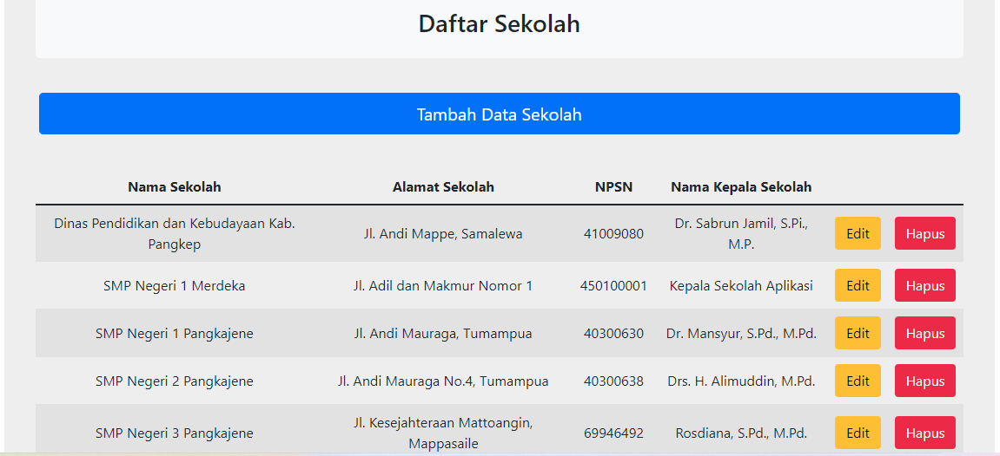 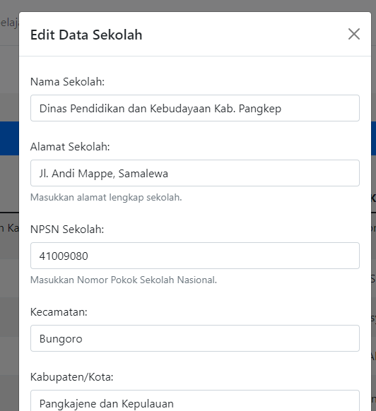

    + Manage principal data 
      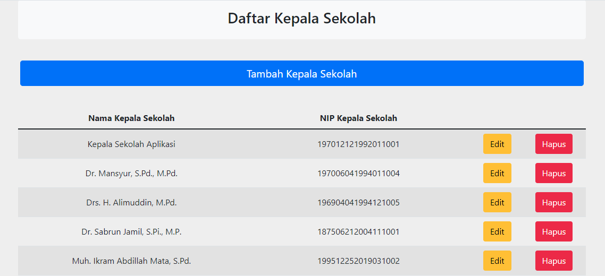 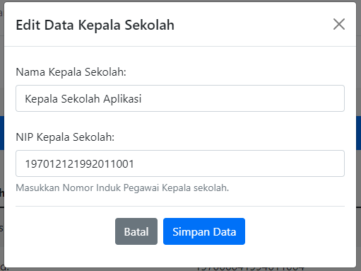
  
  - Basic User for Teacher
    + Register 
      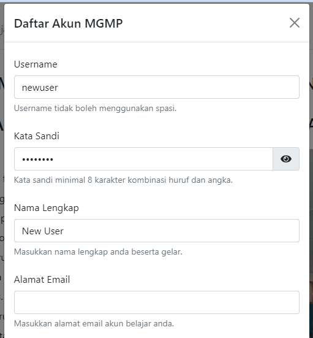 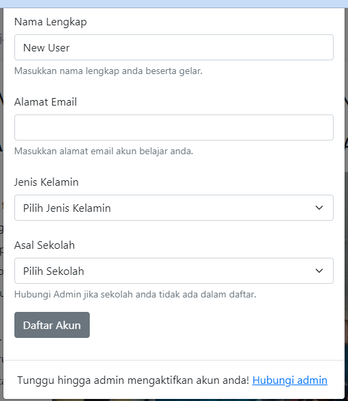

    + Login 
      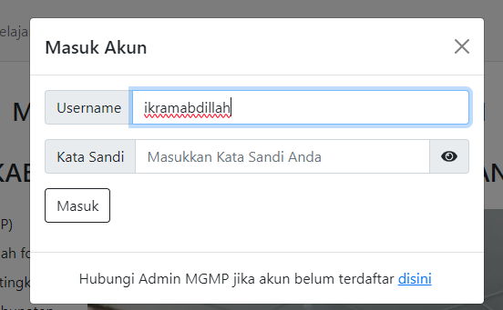

    + Account menu 
      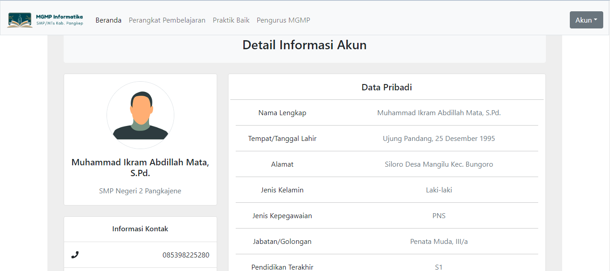 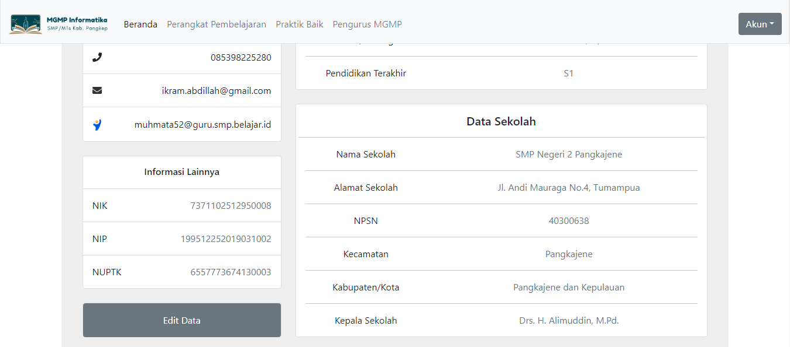

    + Data account edit 
      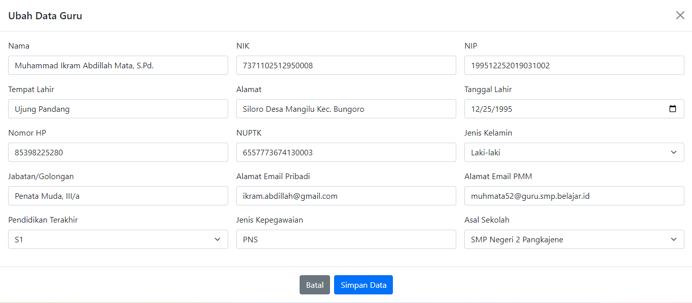
## About CS50
This is CS50x , Harvard University's introduction to the intellectual enterprises of computer science and the art of programming for majors and non-majors alike, with or without prior programming experience. An entry-level course taught by David J. Malan, CS50x teaches students how to think algorithmically and solve problems efficiently. Topics include abstraction, algorithms, data structures, encapsulation, resource management, security, software engineering, and web development. Languages include C, Python, SQL, and JavaScript plus CSS and HTML. Problem sets inspired by real-world domains of biology, cryptography, finance, forensics, and gaming. The on-campus version of CS50x , CS50, is Harvard's largest course. 

Students who earn a satisfactory score on 9 problem sets (i.e., programming assignments) and a final project are eligible for a certificate. This is a self-paced course–you may take CS50x on your own schedule.

### Instructors
- David J. Malan 
  
- Doug Lloyd 
  
- Brian Yu 
  

## License
> For open source project

## Acknolegments
- Kementerian Pendidikan, Kebudayaan, Riset dan Teknologi
- Direktorat Jendral Guru dan Tenaga Kependidikan
- Direktorat Jendral Pendidikan Dasar dan Menengah
- Mentors
- CS50 Staff and Fellow Teachers
