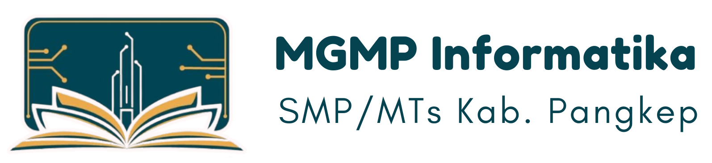

# ITP (INFORMATIC TEACHERS PLATFORM)

## Collaborator
- Muh. Ikram Abdillah Mata
- Yudi Arianto Latief
- Sri Febrina Ramadhani

> Build using CS, Python, Flask, HTML, JavaScript, Bootstrap, FontAwesome, and Sqlite for database

## About Application
The application serves as a digital forum for informatics teachers who are members of the MGMP community. This application provides information about the MGMP Informatics community, starting from activities and documentation of activities, meeting schedules and ultimately the community management structure. In this application, teachers can share lesson plans and good practices about informatics learning in the classroom.
