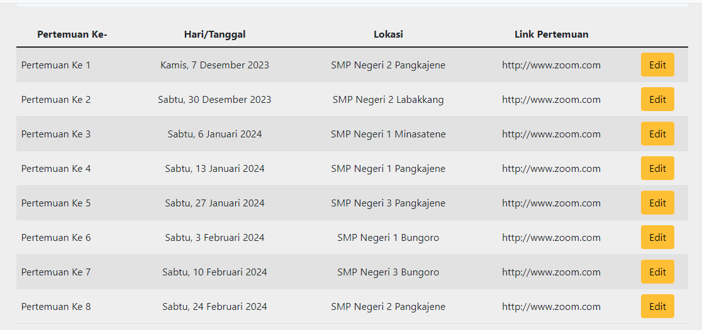
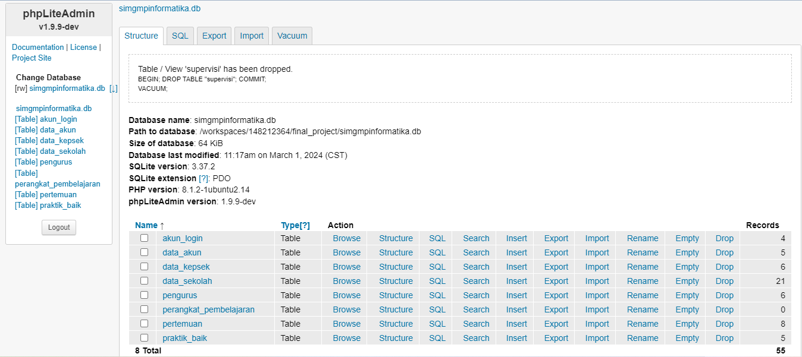

# ITP (INFORMATIC TEACHERS PLATFORM)

## Collaborator
| Muh. Ikram Abdillah Mata | Yudi Arianto Latief | Sri Febrina Ramadhani |
| :---------: | :---------: | :--------: |

> Build using CS, Python, Flask, HTML, JavaScript, Bootstrap, FontAwesome, and Sqlite for database

|  |  |  |  |  |  |
| :--: | :--: | :--: | :--: | :--: | :--: |

## About Application
`ITP (Informatic Teachers Platform)` serves as a digital forum for informatics teachers who are members of the MGMP community. This application provides information about the MGMP Informatics community, starting from activities and documentation of activities, meeting schedules and ultimately the community management structure. In this application, teachers can share lesson plans and good practices about informatics learning in the classroom.

## App Features
> Features:
  - Register and login feature for informatics teacher
  - Share and download lesson plans features
  - Share and download good practice features
> User:
  - Admin User for Admin
    + set the appearance of the app's main page 
      | Homepage | Footer |
      | :------: | :----: |
      |  |  |

    + Set MGMP meeting schedules 
      | Schedule on Homepage | Schedule on Admin Menu |
      | :------: | :-----: |
      |  |  |
      | Edit Schedule | 
      |  |

    + Confirming new user 
      | Confirm Menu on Admin |
      | :-------------------: |
      |  |

    + Manage mgmp community board member data 
      | MGMP Board on Homepage | MGMP Board on Admin Menu |
      | :------: | :-----: |
      |  |  |
      | Edit Member | 
      |  |

    + Manage school data 
      | School Data on Admin | Edit School |
      | :------: | :-----: |
      |  |  |

    + Manage principal data 
      | Principal Data on Admin | Edit Principal |
      | :------: | :-----: |
      |  |  |
  
  - Basic User for Teacher
    + Register 
      | Register Form #1 | Register Form #2 |
      | :------: | :-----: |
      |  |  |

    + Login 
      | Login Form |
      | :------: |
      |  |

    + Account menu 
      | Account Menu #1 | Account Menu #2 |
      | :------: | :-----: |
      |  |  |

    + Data account edit 
      | Edit Data Form |
      | :------: |
      |  |

    + Username and password edit 
      | Username and Password edit Form |
      | :------: |
      |  |

    + Good practice searching 
      | Good practice search form |
      | :------: |
      |  |

    + Searching for good practice 
      | Enter keyword | Good Practice details |
      | :------: | :-----: |
      |  |  |

    + Download or view good practice files 
      | Good practice file views | Good practice video views |
      | :------: | :--------: |
      |  |  |

    + Add own good practice 
      | Add good practice form |
      | :------: |
      |  |

    + Upload good practice 
      | Upload PDF file | Upload Link from YouTube |
      | :------: | :-----: |
      |  |  |

## Database
> Using SQLite

  | Database |
  | :------: |
  |  |
  

> Our app use SQLite with database name <b>simgmpinformatika.db</b> has 8 tables:

  - <b>akun_login</b> for manage data that use to login
  - <b>data_akun</b> for manage informatics teacher datas
  - <b>data_kepsek</b> for manage principal datas
  - <b>data_sekolah</b> for manage school datas
  - <b>pengurus</b> for manage member of community board datas
  - <b>perangkat_pembelajaran</b> for manage lesson plans datas
  - <b>pertemuan</b> for manage MGMP meeting schedule datas
  - <b>praktik_baik</b> for manage good practice datas

## About CS50
This is CS50x , Harvard University's introduction to the intellectual enterprises of computer science and the art of programming for majors and non-majors alike, with or without prior programming experience. An entry-level course taught by David J. Malan, CS50x teaches students how to think algorithmically and solve problems efficiently. Topics include abstraction, algorithms, data structures, encapsulation, resource management, security, software engineering, and web development. Languages include C, Python, SQL, and JavaScript plus CSS and HTML. Problem sets inspired by real-world domains of biology, cryptography, finance, forensics, and gaming. The on-campus version of CS50x , CS50, is Harvard's largest course. 

Students who earn a satisfactory score on 9 problem sets (i.e., programming assignments) and a final project are eligible for a certificate. This is a self-paced course–you may take CS50x on your own schedule.

### Instructors
| David J. Malan | Doug Lloyd | Brian Yu |
| :------------: | :--------: | :------: |
|  |  |  |

## License
> For open source project

## Documentation
- This video can provide more explanation on how the app works:
  > <a href="https://www.youtube.com/watch?v=68mjlXaamWc&ab_channel=KakYudiOfficial">Click Here</a>
## Acknolegments
- Kementerian Pendidikan, Kebudayaan, Riset dan Teknologi
- Direktorat Jendral Guru dan Tenaga Kependidikan
- Direktorat Jendral Pendidikan Dasar dan Menengah
- Mentors
- CS50 Staff and Fellow Teachers
